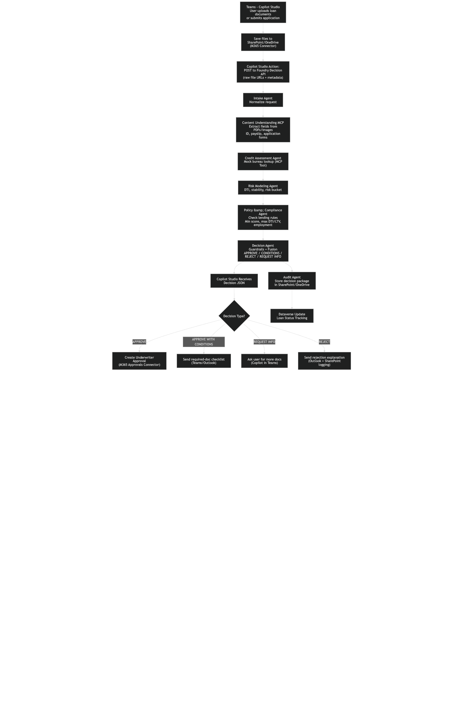

# frontier-platform

## Overview

“Our platform brings together unified data, governed AI, and multi-agent orchestration to deliver complete end-to-end capabilities — not just tools.
Customers get a single, secure, scalable foundation that moves from data to understanding to action, with measurable outcomes proven across industries.”

1. A Capability = an end‑to‑end experience, not a feature list
Narrative: "“Microsoft delivers full, end-to-end capabilities — not disconnected features — so customers can complete high‑value tasks seamlessly with grounding, orchestration, security, and RAI built in.”

2. enable a unified, scalable, governed data-to-agent platform
“Our platform unifies data, governance, and agentic AI into a single, integrated stack — giving customers one foundation for intelligent apps, copilots, and agents at enterprise scale.”

3. Tangible business outcomes
“Our platform drives measurable impact — faster decisions, lower TCO, stronger governance, and AI readiness from day one.”

## Getting Started

Grounding notes (internal): Loan/Mortgage processing is a first‑class Apps‑That‑Matter scenario, and Foundry now provides hosted agents with open‑protocol support (incl. MCP) and built‑in evals/guardrails. Copilot Studio agents surface in Teams/M365 Copilot Chat, can be shared/published via the org catalog, and connect to SharePoint/Dataverse/Graph connectors. Agent identity/governance is evolving via Agent 365.

### Prerequisites

- Python 3.11+
- [uv](https://docs.astral.sh/uv/) package manager
- Azure CLI (`az`)
- Node.js (for MCP Inspector)

### Installation

```bash
# Clone the repository
git clone https://github.com/your-org/frontier-platform.git
cd frontier-platform

# Install dependencies
uv sync

# Copy environment template and configure
cp .env.example .env
# Edit .env with your Azure credentials
```

### Running Locally

#### Start the MCP Server (HTTP)

```bash
uv run python -m loan_processor.local_mcp_server
```

Server endpoints:
- Health check: http://127.0.0.1:8000/health
- MCP endpoint: http://127.0.0.1:8000/mcp

#### Test with MCP Inspector

```bash
npx @modelcontextprotocol/inspector uv run python -m loan_processor.stdio_server
```

This opens a browser UI where you can:
- View available tools (`extract_loan_data`, `get_document_text`)
- Test tools with sample document URLs
- Debug MCP protocol messages

### Generate Sample Data

```bash
# Install PDF generation dependency
uv pip install fpdf2

# Generate a sample loan application PDF
uv run python scripts/generate_sample_pdf.py
```

### Upload Test Documents to Azure

```bash
# Upload sample PDF to Azure Storage
az storage blob upload \
  --account-name $STORAGE_ACCOUNT \
  --container-name loan-documents \
  --name sample-loan-application.pdf \
  --file sample-data/sample-loan-application.pdf \
  --auth-mode login

# Generate a SAS URL for testing
az storage blob generate-sas \
  --account-name $STORAGE_ACCOUNT \
  --container-name loan-documents \
  --name sample-loan-application.pdf \
  --permissions r \
  --expiry $(date -u -v+1d '+%Y-%m-%dT%H:%MZ') \
  --auth-mode login \
  --as-user \
  --full-uri -o tsv
```

## Documentation

